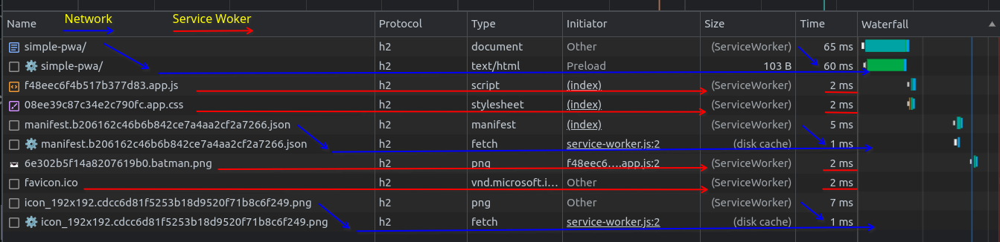
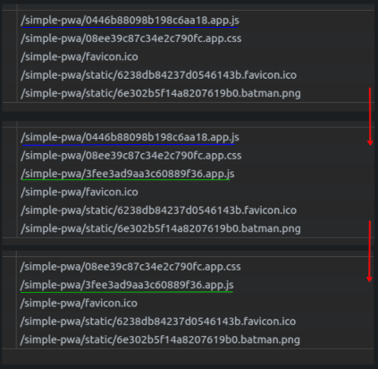

<div align="center">
  <h1><code>simple-pwa</code></h1>

  <a href="https://simple-pwa-tawny.vercel.app/">Deployment link</a>
</div>

### Description
This application shows how a Service Worker `SW` can help improve application loading speed by serving cached bundles from the browser cache [Cache API](https://developer.mozilla.org/en-US/docs/Web/API/Cache).

The core logic here is to serve only specific assets of the application (not html itself).

Here are the steps of using the project:
- Generate assets bundles with `contenthash` as a part of their name
```
ls -R dist

dist:
02715de72abe42650add.app.js
08ee39c87c34e2c790fc.app.css
assets-manifest.json
...
index.html
manifest.b2d4762597ed3608a737c84571d8f89b.json
static/

dist/static:
6238db84237d0546143b.favicon.ico  
6e302b5f14a8207619b0.batman.png

```
- Generate assets log with their names and bundle size
```json
{
  "app.css": {
    "path": "08ee39c87c34e2c790fc.app.css",
    "size": 202
  },
  "app.js": {
    "path": "02715de72abe42650add.app.js",
    "size": 13503
  },
  "static/batman.png": {
    "path": "static/6e302b5f14a8207619b0.batman.png",
    "size": 697469
  },
  "static/favicon.ico": {
    "path": "static/6238db84237d0546143b.favicon.ico",
    "size": 318
  }
}
```
> Assets log includes only specific file types, which will be served from the `SW`
> 
> Please see [webpack.prod](configs/webpack.prod.config.js) for details

- Generate SW bundle with imported assets log
```
ls -R dist

...
service-worker.js
...
```
- `SW` Estimate assets size and available space for them using [StorageManager](https://developer.mozilla.org/en-US/docs/Web/API/StorageManager)
```json
{
  "quotaMemory": 286.39,
  "usedMemory": 0.76,
  "usedSpace": 0.27 
}
```
- `SW` uses [Cache::addAll](https://developer.mozilla.org/en-US/docs/Web/API/Cache/addAll) method to add all assets to browser cache (Cache API)
- `SW` Serves available assets by their name after page reload




- `SW` Cleanup outdated assets from the cache. Please see [CacheManager::deleteOldResources](src/service-workers/managers/cache-manager.ts) for details



In case if any changes will be applied to the project, the name of specific bundle will be changed, and it will be requested by browser (during the html parsing step) by new name.
This way we can ensure that wrong asset will not be served for the new bundle request.

But what about outdated assets?
During the `SW` activation phase the new assets log will be parsed and compared against existing cache. 
All cached resources that are not populated in the new assets log will be deleted to prevent cache congestion.

### Tech stack:
- Typescript
- Webpack

### Suggested readings:
- [web.dev pwa](https://web.dev/learn/pwa/)
- [web.dev serving](https://web.dev/learn/pwa/serving/)
- [MDN Service_Worker_API](https://developer.mozilla.org/en-US/docs/Web/API/Service_Worker_API)
- [Going-Offline-Jeremy-Keith](https://www.amazon.com/Going-Offline-Jeremy-Keith/dp/1937557650)

### Development

Please use `yarn serve` and `yarn build` for development process since the build process is separated on 2 steps, where `SW` bild waits on the main build.
